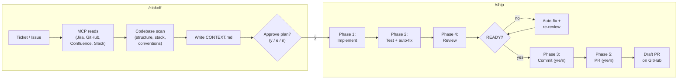
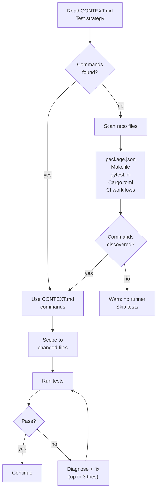

# Architecture

Two Cursor agent skills — `/kickoff` and `/ship` — connected by a single
file, `CONTEXT.md`.

## Components

| Piece | Path | Role |
|-------|------|------|
| **Kickoff** | `skills/kickoff/SKILL.md` | Read ticket + analyze repo → write `CONTEXT.md` → user approves plan |
| **Ship** | `skills/ship/SKILL.md` | Implement → test → review → commit → PR, all grounded in `CONTEXT.md` |
| **Context template** | `skills/shared/context-template.md` | Starter structure for `CONTEXT.md` |
| **Transcript helper** | `skills/shared/transcript_helper.py` | Scores Cursor chat logs against a diff for commit/PR context |

Install layout (copy into any project):

```
.cursor/skills/
├── kickoff/SKILL.md
├── ship/SKILL.md
└── shared/
    ├── context-template.md
    └── transcript_helper.py
```

---

## End-to-end flow



---

## CONTEXT.md — the contract

`CONTEXT.md` is the single file that carries state between kickoff and
every phase of ship.  It has two layers:

### Layer A: Work item (changes per ticket)

| Section | Written by | Read by |
|---------|-----------|---------|
| Source, Summary, Why | Kickoff Step 1 | Ship Phase 1 (implement), Phase 3 (commit), Phase 4 (review), Phase 5 (PR) |
| Acceptance criteria | Kickoff Step 1 | Ship Phase 4 (review alignment) |
| Scope (files table) | Kickoff Step 3 | Ship Phase 1 (implement) |
| Plan | Kickoff Step 4 | Ship Phase 1 (implement) |
| Links | Kickoff Step 1c | Ship Phase 5 (PR body) |

### Layer B: Project (stable per repo, refreshed each kickoff)

| Section | Written by | Read by |
|---------|-----------|---------|
| Repo, Stack, Layout | Kickoff Step 2 | Ship Phase 1 (coding style) |
| Patterns (philosophy) | Kickoff Step 2e | Ship Phase 1 (coding style), Phase 4 (review) |
| Test commands | Kickoff Step 2c | Ship Phase 2 (test discovery) |
| Lint/format | Kickoff Step 2c | Ship Phase 2 (test discovery) |
| PR template | Kickoff Step 2d | Ship Phase 5 (PR body structure) |

### Progress tracking

Both skills update the Progress checklist:

```
- [x] Kickoff complete       ← kickoff Step 5
- [x] Plan approved          ← kickoff Step 5
- [x] Implemented            ← ship Phase 1
- [x] Tests green            ← ship Phase 2
- [x] Reviewed               ← ship Phase 4
- [x] Committed              ← ship Phase 3
- [x] PR opened (URL)        ← ship Phase 5
```

---

## Human gates

Three approval points exist across the entire pipeline.  Everything
else runs autonomously.

| Gate | Skill / Phase | What the user sees | Options |
|------|--------------|---------------------|---------|
| **Plan approval** | Kickoff Step 5 | Full CONTEXT.md printed in chat | y = approve, e = edit (next msg), n = abort |
| **Commit message** | Ship Phase 3 | Generated message in fenced block | y = commit, e = edit (next msg), n = skip |
| **PR body** | Ship Phase 5 | Draft PR with title, body, commits | y = create, e = edit (next msg), n = skip |

The **e** option is the same everywhere: the user's next message IS the
edited content — no second confirmation round.

---

## MCP flexibility

Kickoff uses whatever MCP servers the user has configured.  Each source
is optional; the skill degrades gracefully.

| MCP server | Used in | Required? | Fallback |
|------------|---------|-----------|----------|
| **Jira** (Atlassian) | Kickoff Step 1b | No | User pastes ticket text |
| **GitHub** | Kickoff Step 1b | No | `gh` CLI as fallback |
| **Confluence** | Kickoff Step 1c | No | Skip, note in Links |
| **Slack** (read-only) | Kickoff Step 1c | No | Skip, note in Links |
| **Google Docs** | Kickoff Step 1c | No | Skip, note in Links |

Ship does **not** call MCPs — it uses `CONTEXT.md` (already filled by
kickoff) plus `git` and `gh` CLI.

**MCP safety rules** (applied in kickoff):

1. Read the tool's JSON schema before calling.
2. Call `mcp_auth` if the server needs authentication.
3. All reads are non-destructive — kickoff never writes to Jira, GitHub,
   Confluence, or Slack.

---

## Phase selection (natural language)

Ship parses the user's message after `/ship` to determine which phases
to run.

| User says | Phases executed |
|-----------|----------------|
| `/ship` (bare) | 1 → 2 → 4 → 3 → 5 (full pipeline) |
| `/ship implement` | 1 only |
| `/ship test` | 2 only |
| `/ship review` | 4 only |
| `/ship commit` | 3 only |
| `/ship pr` | 5 only |
| `/ship test and commit` | 2 → 3 |
| `/ship review and commit` | 4 → 3 |
| `/ship implement and test` | 1 → 2 |

Phases always execute in pipeline order (1 → 2 → 4 → 3 → 5) regardless
of how the user phrases them.

---

## Test discovery (Phase 2 detail)

Ship does not hardcode test commands.  It discovers them dynamically per
repository:



---

## Review passes (Phase 4 detail)

Four sequential passes, each with a specific focus:

| Pass | Focus | Checks against |
|------|-------|----------------|
| **1. Context alignment** | Does diff satisfy each AC? | CONTEXT.md acceptance criteria |
| **2. Logic and bugs** | Race conditions, null checks, error paths | Diff line-by-line |
| **3. Security** | Injection, secrets, authz | Diff + file content |
| **4. Quality** | Debug leftovers, dead code, typos | Diff |

Output uses `[STATUS]: NEEDS_WORK` or `[STATUS]: READY` with per-finding
severity (`CRITICAL`, `HIGH`, `MEDIUM`, `LOW`), file:line, and concrete
fix diffs.

On `NEEDS_WORK`: auto-fix critical/high issues, re-review, up to 3 cycles.

---

## Relation to other skills

These two skills are **standalone** — they do not require the older
`commit`, `pr`, or `draft-pr` skills in `skills/`.  Ship incorporates
their logic (commit-tree trick, fork-aware PR creation, trailer scrubbing)
directly.

| Other skill | Overlap | Use when |
|-------------|---------|----------|
| `skills/commit/` | Ship Phase 3 covers this | Use standalone `/commit` only if you don't want the full ship pipeline |
| `skills/pr/` | Ship Phase 5 covers this | Use standalone `/pr` for immediate non-draft PRs outside the ship flow |
| `skills/draft-pr/` | Ship Phase 5 covers this | Use standalone `/draft-pr` for draft PRs outside the ship flow |
| Global `address-github-pr-comments` | Not in ship | Use after PR is open to address reviewer feedback |
| Global `review-pr` | Not in ship | Use to review someone else's PR |
